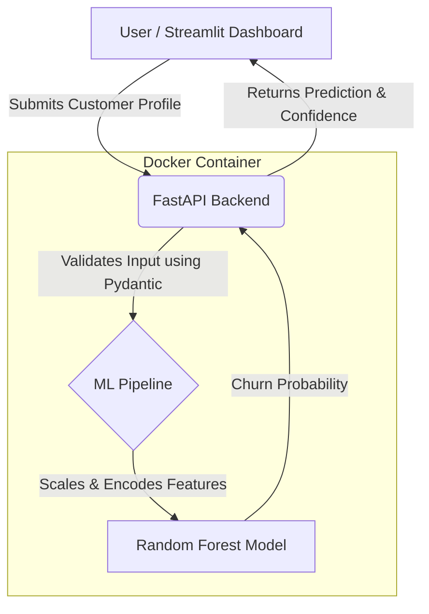

# 📉 Customer Churn Prediction with MLOps

## 📌 Overview
A production-ready Machine Learning system that predicts customer churn for a telecommunications company. This project goes beyond building a model in a Jupyter Notebook—it demonstrates how to train, package, serve, and consume a machine learning model using modern MLOps practices. Built with Scikit-Learn, FastAPI, Streamlit, and Docker.

## 💼 Business Problem
Customer churn (cancellation of service) is a significant challenge for telecommunication companies. Because acquiring a new customer is significantly more expensive than retaining an existing one, predicting which customers are at a high risk of canceling allows businesses to proactively target them with retention strategies (e.g., discounts, personalized support), thereby reducing churn and increasing revenue.

## 🏗️ Architecture



## 🚀 How to Run the Project Locally

### Prerequisites
- Docker
- Python 3.9+

### 1. Start the API (Backend)
The backend prediction service is containerized for reproducibility. Run the following command from the root directory:

```bash
docker build -t churn-prediction-api .
docker run -p 8000:8000 churn-prediction-api
```
The API will be available at `http://localhost:8000`. You can test the interactive documentation at `http://localhost:8000/docs`.

### 2. Start the Dashboard (Frontend)
Open a new terminal and run your frontend application:

```bash
pip install -r dashboard/requirements.txt
python -m streamlit run dashboard/app.py
```
The Streamlit dashboard will be accessible at `http://localhost:8501`.

## 📸 Application Screenshot


*(Add a beautiful screenshot of your dashboard here!)*
