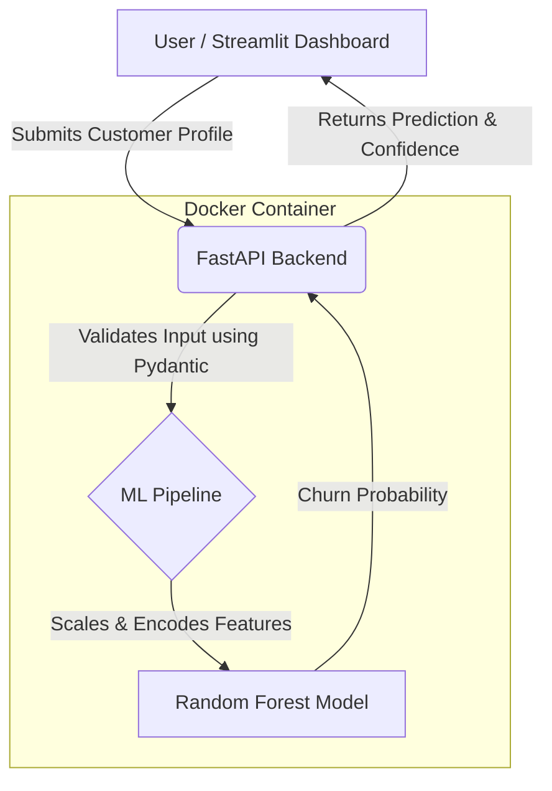

# Customer Churn Prediction with MLOps
 
  Customer Churn Prediction with MLOps
  
📌 Overview
A production-grade Machine Learning system for predicting customer churn in telecommunications, built to demonstrate a full MLOps lifecycle — from model training and feature engineering to containerised API serving and interactive inference. The pipeline is implemented using Scikit-Learn for modelling, FastAPI for backend inference, Streamlit for the front-end dashboard, and Docker for containerisation and reproducibility.

💼 Business Problem
Customer churn represents a critical revenue leakage problem in telecommunications. Given that customer acquisition costs typically outpace retention costs by a significant margin, early identification of high-risk customers enables targeted intervention — retention offers, personalised outreach, or service adjustments — before cancellation occurs. This system operationalises that identification by exposing a trained classification model as a real-time REST API, allowing downstream business systems to query churn probability at the individual customer level and trigger automated retention workflows accordingly.

## 🏗️ Architecture



## 🚀 How to Run the Project Locally

### Prerequisites
- Docker
- Python 3.9+

### 1. Start the API (Backend)
The backend prediction service is containerized for reproducibility. Run the following command from the root directory:

```bash
docker build -t churn-prediction-api .
docker run -p 8000:8000 churn-prediction-api
```
The API will be available at `http://localhost:8000`. You can test the interactive documentation at `http://localhost:8000/docs`.

### 2. Start the Dashboard (Frontend)
Open a new terminal and run your frontend application:

```bash
pip install -r dashboard/requirements.txt
python -m streamlit run dashboard/app.py
```
The Streamlit dashboard will be accessible at 'https://h3paawdmkdcyq4tdtak6jj.streamlit.app'

## 📸 Application Screenshot


## ☁️ Deployment

This project is deployed using Render (for the FastAPI backend) and Streamlit Cloud (for the frontend). 

> **Note on Render Free Tier**: The backend is hosted on a free Render instance, which automatically spins down after periods of inactivity. If the Streamlit dashboard reports the API as "Offline" or takes a long time to load, please allow up to 60 seconds for the free-tier container to perform a 'cold start'.


